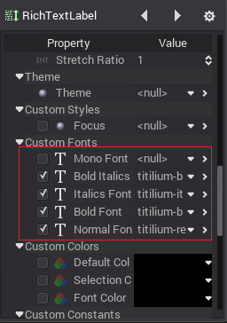

# BBCode for RichTextLabel

### Introduction

[RichTextLabel](class_richtextlabel) allows to display complex text markup in a control. It has a built-in API for generating the markup, but can also parse a BBCode.

### Setting Up

For RichTextLabel to work properly, it must be set-up. This means loading the intended fonts in the releavant properties:

### Reference

Command | Tag | Description
--------|-----|-------------
*bold* | `[b]{text}[/b]` | Makes {text} bold.
*italics* | `[i]{text}[/i]` | Makes {text} italics.
*underline* | `[u]{text}[/u]` | Makes {text} underline.

